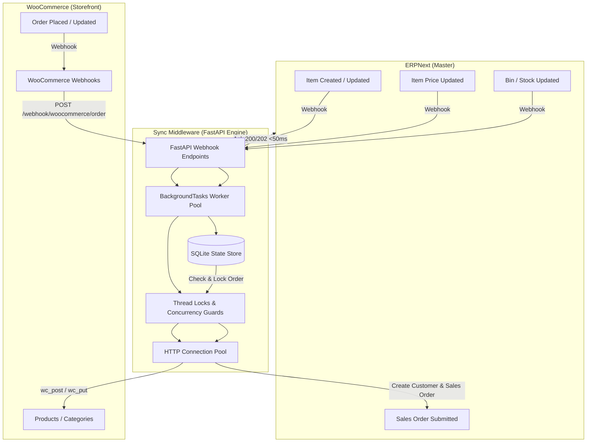

# ERPNext & WooCommerce Two-Way Synchronization Engine

[](https://www.python.org/)
[](https://fastapi.tiangolo.com/)
[](https://erpnext.com/)
[](https://woocommerce.com/)
[](https://opensource.org/licenses/MIT)

A high-performance, production-ready asynchronous synchronization engine connecting **ERPNext** (acting as single source of truth / Master) and **WooCommerce** (storefront).

Designed for resilience and low CPU overhead, this service features **real-time webhook dispatching**, **thread-safe de-duplication locks**, **HTTP connection pooling**, **SQLite-backed state persistence**, and **smart backlog catch-up**.

---

## 📑 Table of Contents

- [Overview](#-overview)
- [Architecture & Data Flow](#-architecture--data-flow)
- [Key Features](#-key-features)
- [Project Structure](#-project-structure)
- [Prerequisites](#-prerequisites)
- [Installation & Quickstart](#-installation--quickstart)
- [Configuration Guide](#-configuration-guide)
  - [1. Environment Variables](#1-environment-variables)
  - [2. ERPNext Setup & Webhooks](#2-erpnext-setup--webhooks)
  - [3. WooCommerce REST API & Webhooks](#3-woocommerce-rest-api--webhooks)
- [Running the Service](#-running-the-service)
- [API Endpoints](#-api-endpoints)
- [Production Architecture & Resilience](#-production-architecture--resilience)
- [Troubleshooting & FAQs](#-troubleshooting--faqs)
- [License](#-license)

---

## 🌟 Overview

Operating an e-commerce platform alongside an enterprise ERP often encounters race conditions, duplicate sales orders, webhook storms, and severe rate limiting. 

This engine bridges that gap by providing:
1. **ERPNext ➔ WooCommerce (Catalog & Inventory):** Automatically pushes new items, price adjustments (`Item Price`), and inventory balance (`Bin`) changes to WooCommerce immediately via webhooks.
2. **WooCommerce ➔ ERPNext (Orders):** Captures incoming WooCommerce orders via webhooks, provisions customer profiles and delivery addresses, and creates submitted Sales Orders in ERPNext in real time.
3. **Automated Fallback & Catch-Up:** A scheduled runner incrementally scans for missed or backlogged orders using persistent SQLite timestamp checkpoints.

---

## 🔄 Architecture & Data Flow



---

## 🚀 Key Features

* **⚡ Ultra-Low Latency & Asynchronous Webhooks:** Built on FastAPI with non-blocking `BackgroundTasks`. Returns immediate `<50ms` acknowledgments to incoming webhooks to prevent sender timeouts and retry loops.
* **🛡️ Concurrency Locks & De-duplication:** Per-order and per-SKU thread locks prevent race conditions and duplicate order/product creation when burst webhooks arrive concurrently.
* **🗄️ Embedded SQLite State Engine (`processed_orders.db`):** Zero-dependency, serverless local database for atomic order lookup, status checkpoints, and instant recovery. Automatically migrated from legacy JSON logs with backup preservation.
* **🔌 HTTP Keep-Alive & Connection Pooling:** Shared `requests.Session` instances eliminate repetitive TCP/SSL handshakes, cutting API overhead by up to 50%.
* **🔁 Automatic Rate-Limit & Transient Error Recovery:** 
  * Intercepts WooCommerce HTTP `429 Too Many Requests`, parses the `Retry-After` header, and automatically retries with backoff.
  * Retries transient network interruptions and ERPNext `502`/`503` gateway timeouts.
* **📦 Product Sync Safeguards:** Gracefully falls back if WooCommerce category resolution fails, and protects against `None` standard rates to prevent API rejection.
* **🕒 Incremental Backlog Catch-Up:** Scheduled runner queries WooCommerce page-by-page since the last recorded SQLite timestamp checkpoint, preventing data loss during network downtimes.
* **📜 Rotating Production Logging:** Configurable logging writing to both terminal and `logs/sync_service.log` with size-based log rotation (5MB, 5 backups).

---

## 📂 Project Structure

```text
erpnext-woocommerce-sync/
├── app.py                   # FastAPI server handling webhook endpoints & background jobs
├── config.py                # Environment variable loader
├── erpnext_client.py        # ERPNext REST API client (Session-pooled with retry logic)
├── woocommerce_client.py    # WooCommerce REST API client (Session-pooled with 429 handler)
├── product_sync.py          # Item, category, price, and stock transformation & sync logic
├── order_sync.py            # WooCommerce order ingestion, payload builder, & address normalizer
├── sync_runner.py           # Core order processing logic, scheduled polling, & full sync
├── processed_orders.py      # SQLite database layer for order locking & sync checkpoints
├── utils.py                 # Text sanitizer & centralized rotating logging configuration
├── main.py                  # Entrypoint for manual single-product synchronization
├── requirements.txt         # Project dependencies
├── .env.example             # Template for required environment variables
└── logs/                    # Rotating log storage
    └── sync_service.log
```

---

## 📋 Prerequisites

* **Python:** 3.10 or higher
* **ERPNext:** v14 or v15 instance with administrative access to configure REST API Keys and Webhooks.
* **WooCommerce:** v3+ running on WordPress with REST API enabled and HTTPS configured.
* **Public URL / Reverse Proxy:** For development, a tool like [ngrok](https://ngrok.com/) or Cloudflare Tunnels is required to receive external webhooks.

---

## 🛠️ Installation & Quickstart

### 1. Clone the Repository
```bash
git clone https://github.com/your-username/erpnext-woocommerce-sync.git
cd erpnext-woocommerce-sync
```

### 2. Create and Activate Virtual Environment
```bash
# Windows
python -m venv venv
venv\Scripts\activate

# Linux / macOS
python3 -m venv venv
source venv/bin/activate
```

### 3. Install Dependencies
```bash
pip install -r requirements.txt
```

### 4. Setup Configuration
Copy the example `.env.example` file to `.env`:
```bash
cp .env.example .env
```
Fill in your API credentials (see [Configuration Guide](#-configuration-guide)).

---

## ⚙️ Configuration Guide

### 1. Environment Variables

Edit `.env` with your instance credentials:

```ini
# ERPNext API Settings
ERPNEXT_URL=https://your-instance.frappe.cloud
ERPNEXT_API_KEY=your_api_key
ERPNEXT_API_SECRET=your_api_secret

# WooCommerce API Settings
WC_URL=https://your-store.com
WC_CONSUMER_KEY=ck_xxxxxxxxxxxxxxxxxxxxxxxxxxxxxxxxxxxxxxxx
WC_CONSUMER_SECRET=cs_xxxxxxxxxxxxxxxxxxxxxxxxxxxxxxxxxxxxxxxx
```

---

### 2. ERPNext Setup & Webhooks

Log into your ERPNext desk and configure webhooks under **Integrations > Webhook**:

#### A. Webhook: Item Created / Updated
* **DocType:** `Item`
* **Doc Event:** `after_insert` (for created) and `on_update` (for updated)
* **Request URL:** `https://<YOUR_DOMAIN>/webhook/erp/item-created`
* **Request Method:** `POST`
* **Request Structure:** `JSON`
* **Webhook Data Table:**
  | Key | Value |
  | :--- | :--- |
  | `name` | `doc.name` |
  | `item_code` | `doc.item_code` |

#### B. Webhook: Item Price Updated
* **DocType:** `Item Price`
* **Doc Event:** `after_insert` and `on_update`
* **Request URL:** `https://<YOUR_DOMAIN>/webhook/erp/item-price-updated`
* **Request Method:** `POST`
* **Request Structure:** `JSON`
* **Webhook Data Table:**
  | Key | Value |
  | :--- | :--- |
  | `item_code` | `doc.item_code` |

#### C. Webhook: Stock Balance Updated
* **DocType:** `Bin`
* **Doc Event:** `after_insert` and `on_update`
* **Request URL:** `https://<YOUR_DOMAIN>/webhook/erp/stock-updated`
* **Request Method:** `POST`
* **Request Structure:** `JSON`
* **Webhook Data Table:**
  | Key | Value |
  | :--- | :--- |
  | `item_code` | `doc.item_code` |

---

### 3. WooCommerce REST API & Webhooks

#### Generate REST API Credentials
1. Go to **WooCommerce > Settings > Advanced > REST API**.
2. Click **Add Key**, set Permissions to **Read/Write**, and copy `Consumer Key` and `Consumer Secret` into `.env`.

#### Configure Order Webhook
1. Go to **WooCommerce > Settings > Advanced > Webhooks**.
2. Click **Add webhook**:
   * **Name:** `ERPNext Order Sync`
   * **Status:** `Active`
   * **Topic:** `Order created` (and a second webhook for `Order updated`)
   * **Delivery URL:** `https://<YOUR_DOMAIN>/webhook/woocommerce/order`
   * **API Version:** `WP REST API Integration v3`

---

## 🏃 Running the Service

### Development Mode (with Live Reload)
```bash
uvicorn app:app --host 0.0.0.0 --port 8000 --reload
```

### Production Deployment (Systemd / Gunicorn)
You can deploy using Uvicorn workers behind a reverse proxy (Nginx / Caddy):
```bash
uvicorn app:app --host 0.0.0.0 --port 8000 --workers 4
```

### Manual Trigger for Full Backlog Sync
To trigger a manual catalog push and order pull without waiting for webhooks:
```bash
# Via cURL
curl -X POST http://localhost:8000/sync-now

# Or directly in Python
python -c "from sync_runner import run_full_sync; run_full_sync()"
```

### Background Poller Daemon
To enable the background recurring poller along with the webhook API, uncomment the startup event in `app.py`:
```python
@app.on_event("startup")
def startup_event():
    sync_thread = threading.Thread(target=run_forever, daemon=True)
    sync_thread.start()
```

---

## 📡 API Endpoints

| Method | Endpoint | Description |
| :--- | :--- | :--- |
| `GET` | `/health` | Service liveness and health probe |
| `POST` | `/sync-now` | Triggers a full product and backlog order sync |
| `POST` | `/webhook/woocommerce/order` | Ingests real-time WooCommerce order payloads |
| `POST` | `/webhook/erp/item-created` | Ingests ERPNext item creation events |
| `POST` | `/webhook/erp/item-updated` | Ingests ERPNext item update events |
| `POST` | `/webhook/erp/item-price-updated` | Ingests ERPNext price list changes |
| `POST` | `/webhook/erp/stock-updated` | Ingests ERPNext stock balance (Bin) updates |

---

## 🛡️ Production Architecture & Resilience

### Check-and-Lock De-duplication
Order events frequently trigger multiple webhooks in rapid succession (e.g., `pending` ➔ `processing` within milliseconds). 

```text
Incoming Webhook (Order #1001)
         │
         ▼
[Check and Lock: Order #1001]
         ├── Already Processing? ────► [Skip & Return 200]
         └── Not Processing?
                  │
                  ▼
         [Lock State in SQLite]
                  │
                  ▼
         [Create Sales Order in ERPNext]
                  │
                  ▼
         [Mark Complete in SQLite]
```

If an order is already actively syncing or is already at the target status, the thread releases immediately, preventing duplicate ERPNext Sales Orders.

### LRU In-Memory Caching
Static or infrequently modified metadata is cached in-memory:
* ERPNext Default Company & Default Warehouse
* ERPNext Selling Price List
* WooCommerce Product Categories (automatically evicted upon category creation)
* WooCommerce SKU-to-ID lookup map

---

## ❓ Troubleshooting & FAQs

#### Q: Terminal displays `422 Unprocessable Content` on webhooks?
**Cause:** FastAPI request body type-validation failed because ERPNext sent payloads with custom headers or without `Content-Type: application/json`.  
**Fix:** Handlers parse raw requests asynchronously (`await request.json()`), which tolerates header discrepancies seamlessly.

#### Q: ERPNext item updates fire but the product does not show in WooCommerce?
**Cause:** In ERPNext, webhooks do not automatically serialize the document fields unless specified.  
**Fix:** Ensure you have added `name` -> `doc.name` in the **Webhook Data** table of your ERPNext Webhook settings.

#### Q: How are multiple price/stock webhooks for the same product handled?
**Fix:** `product_sync.py` implements a per-SKU thread lock. Updates for the same SKU queue sequentially, preventing race conditions.

---

## 📄 License

Distributed under the MIT License. See [LICENSE](LICENSE) for more information.
